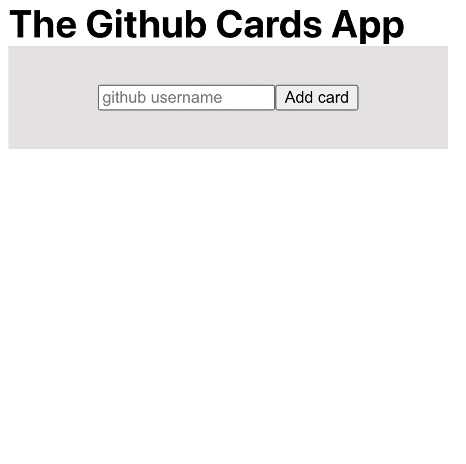
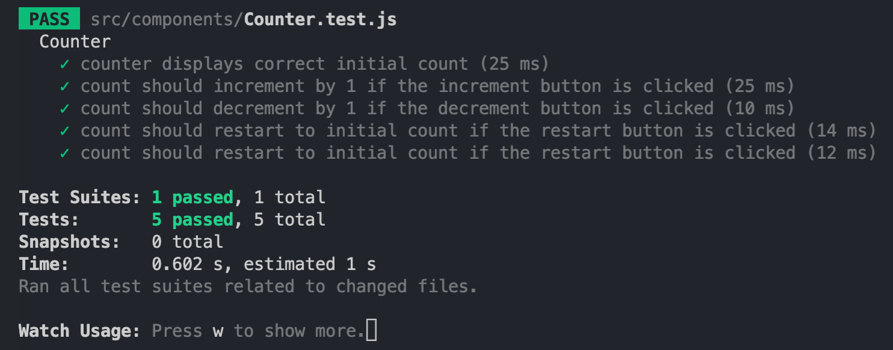

# Multiverse Self Study Plan


##### Table of Contents
- [Multiverse Self Study Plan](#multiverse-self-study-plan)
        - [Table of Contents](#table-of-contents)
  - [Technologies to focus on](#technologies-to-focus-on)
  - [Overall Idea for Final Project](#overall-idea-for-final-project)
  - [What am I using to study?](#what-am-i-using-to-study)
  - [Progress](#progress)
    - [Monday](#monday)
    - [Tuesday](#tuesday)
    - [Wednesday](#wednesday)

## Technologies to focus on
- React
  - useContext hook
  - Other React 18 Hooks
- Jest 

## Overall Idea for Final Project
Create a project in React using Context (with useContext hook) for state management. Additionally, you could learn how to use Jest to specifically test your React frontend, as Jest comes prebuilt in the create-react-app. Additionally, think about trying to familiarize yourself with the new hooks of React 18.

## What am I using to study?
- [x] [React 17: Getting Started](https://app.pluralsight.com/library/courses/react-js-getting-started/table-of-contents)
- [x] [React Hooks Course](https://www.youtube.com/watch?v=LlvBzyy-558)
- [x] [useTransition Hook](https://www.youtube.com/watch?v=N5R6NL3UE7I)
- [x] [useDefferedValue Hook](https://www.youtube.com/watch?v=jCGMedd6IWA)
- [x] [useId Hook](https://www.youtube.com/watch?v=_vwCKV7f_eA&list=RDCMUCFbNIlppjAuEX4znoulh0Cw&index=14)
- [x] [React Context API Course](https://www.youtube.com/watch?v=t9WmZFnE6Hg)
- [x] [Testing React with Jest](https://www.youtube.com/watch?v=JBSUgDxICg8)

## Progress
[Pluralsight Profile](https://app.pluralsight.com/profile/andrea-berrocal-b)

### Monday 

Started [React 17: Getting Started](https://app.pluralsight.com/library/courses/react-js-getting-started/table-of-contents) 
- Why react?
  - React is a library not a framework, so it is flexible, you do not have to code everything a certain way. It is also small so it can be customized a lot. React makes working with the DOM a lot easier. Instead of making a JavaScript file and using code like ``` document.getElementById() ``` to grab each individual element in an HTML file, react allows you to work with the virtual DOM. 
  - React is a declarative language, we as developers can describe what we want an app to do and then the app will do it. We describe a user interface in terms of a final state. Then everytime the state changes react changes the UI.
- Basic concepts
  - Components (AKA functions)
    - React Components receive input objects and output objects just like a function. Components are also reusuable and they can manage a private state.
  - Reactive updates
    - react will react to state changes in components and automatically change the UI according to those changes
  - Virtual Views in memory
    - No HTML template language, we use JSX
    - Tree reconciliation
- First React Component
   ```javascript
    import { useState } from 'react';
    function App() {

    // button that starts at 5 a doubles everytime it is clicked
    const[counter, setCounter] = useState(5);

    return (
        <div className="App">
            <button 
            onClick={() => setCounter(counter * 2)}>
            {counter}
            </button>
        </div>
        );
    }

    export default App; 
    ```

- One-Way Data Flow
    - Parent components can flow data and behavior to their child components through props
- Seperation of responsibilities (concerns)
    - make components that each have different responsibilites
        ```javascript
            import './App.css';
        import Display from './components/Display';
        import Button from './components/Button';
        import { useState } from "react";

        function App() {

        const[counter, setCounter] = useState(0);

        const incrementCounter = (increment) => setCounter(counter + increment);

        return (
            <div className="App">
            <Button onClickFunction={incrementCounter} increment={1}/>
            <Button onClickFunction={incrementCounter} increment={5}/>
            <Button onClickFunction={incrementCounter} increment={10}/>
            <Button onClickFunction={incrementCounter} increment={100}/>
            <Button onClickFunction={incrementCounter} increment={200}/>
            <Display counter={counter}/>
            </div>
        );
        }

        export default App;
        ```
        ```javascript
            const Display = (props) => {

            return(
                <div>{props.counter}</div>
            );
        }
        export default Display;
        ```
        ```javascript
            const Button = (props) => {
            const handleClick = () => props.onClickFunction(props.increment)
            return(
                <button onClick={handleClick}>+{props.increment}</button>
            );
        }
        export default Button;
        ```

#### Modern JS Crash Course
- Block scope
    - if we declare a var variable in a block scope, the variable can be accessed outside of it, in modern javascript it is reccommended to use let instead. With let, variables can not be accessed outside of block scope.
        ``` javascript
        for(var i = 1; i <= 10; i++){
            //blocks scope
        }
        //with var i can be accessed from outside which can cause issues instead use let
        for(let i = 1; i<= 10; i++){
            //block scope
        }
        //with let, the variable i can not be accessed
        ```
- Function Scope
    ```javascript
    function sum(a, b){
        //function scope
        let result = a + b
    }
    ```
- const variables
  - use const when the reference assigned to a variable is meant to be constant.
  - const strings and numbers are not mutable however const arrays are objects are. We can not change the reference (so the array or object will always be pointing to the same array or object) but we can change the content of the array or object. So we can push into an array or change values in an object. For example the following code would work and would not cause any errors.
    ``` javascript
    const numbers = [2,4,6];

    numbers.push(7);
    console.log(numbers); // [2, 4, 6, 7]

    const person ={
        firstName:'Bob',
        lastName:'Riley'
    };

    person.firstName = 'Sarah';
    console.log(person) // { firstName: 'Sarah', lastName: 'Riley' }
    ```
- Object Literal

  ```javascript
  const mystery = 'answer';
  const InverseOfPI = 1 / Math.PI;

    const obj= {
    p1: 10,
    p2: 20,
    f1() {},
    f2: () => {},
    [mystery]: 42,
    InverseOfPI, //same as typing InverseOfPI: InverseOfPI
    }

    console.log(obj.mystery) // undefined
    console.log(obj.answer) // 42
  ```
- Desctructuring and Rest/Spread
    ```javascript
    //instead of 
    const PI = Math.PI;
    const E = Math.E;
    const SQRT2 = Math.SQRT2;

    //use
    const {PI, E, SQRT2} = Math;

    const[first, second, third, forth] = [10,20,30,40];

    console.log(first); // 10

    // spread operator
    const[first, ...restOfItems] = [10,20,30,40];
    console.log(restOfItems); // [ 20, 30, 40 ]

    const data = {
    temp1: '001',
    temp2: '002',
    firstName: 'John',
    lastNameL: 'Doe'
    };

    //create a new object that has the same data except for temp1 and temp2
    const{temp1, temp2, ...person} = data;

    console.log(person); // { firstName: 'John', lastNameL: 'Doe' }

    const newObj = {
    ...person
    }
    console.log(newObj); // { firstName: 'John', lastNameL: 'Doe' }
    ```
- Classes
    ```javascript
    class Person{
        constructor(name){
            this.name = name;
        }
        //method
        greet() {
            console.log(`Hello ${this.name}`)
        }
    }
    //child of Person class
    //Student class inherets variables and methods from parent class
    class Student extends Person{
        constructor(name, level){
            super(name);
            this.level = level;
        }
        greet() {
            console.log(`Hello ${this.name} from ${this.level}`)
        }
    }

    //classes are blueprints for objects
    //to instantiate an object from a class you need to use new keyword
    const o1 = new Person("Max");
    const o2 = new Student("Tina", "11th Grade");
    const o3 = new Student("Mary", "10th Grade");
    //change what greet logs
    o3.greet = () => console.log('I am special!'); 

    o1.greet(); //Hello Max
    o2.greet(); //Hello Tina from 11th Grade
    o3.greet(); //I am Special!
    ```
 - Promises and Async/Await
    ```javascript
    const fetchData = async () => {
        const response = await fetch('https://api.github.com');
        const data = await response.json();
        console.log(data);
        }
    fetchData();
    ```
- The GitHub Cards App
  - App that using axios to get github users by inputting their username
  - used both class components and function components to better understand class components
  - compononents:
    - Card
    - CardList
    - Form
  - images:
    
    
    
    

### Tuesday 
- The Star Match Game
  - users have to select numbers that add up to the number of stars
  - if user selects a number or group of numbers that are greater than the amount of stars, the numbers turn red
  - numbers selected that match or add up to the number of stars turn green
  - if a user selects a number than it less than the number of stars it turns blue
  - if a user does not complete the game within 10 seconds, the game resets. In react the game is reset when the id of the comonent changes and react unmounts and remounts the game component which resets all states.
  - used custom hooks, useEffect, and useState
- images:
  
- React Hooks
   - useState hook
      - a hook that lets us add state to function components
      - ``` const [val, setVal] = useState(initialVal);```
      - val is the state variable
      - setVal is a function to change the state
      - we pass an inital value in useState when we first declare it
  
    ```javascript
    import { useState } from 'react';
    import './App.css';

    function App() {
      const [inputText, setInputText] = useState('');
      const [historyList, setHistoryList] = useState([]);

      return (
        <div className="App">
          <input 
          value={inputText} 
          onChange={(event) => {
          setInputText(event.target.value);
          setHistoryList([...historyList, event.target.value]);
          }}
          placeholder='Enter some text' />
          <div>{inputText}</div>
          <ul>
            {historyList.map((item, index) => <div key={index}>{item}</div>)}
          </ul>
        </div>
      );
    }

    export default App;
    ```

      - code above keeps track of user input by tracking any changes with onChange(). Anytime a user changes the input, that change is set in the inputText state. There is also a historyList state which keeps tracks of all changes being done.
  - useRef Hook
    - allows us to directly access an element in the DOM
    - In the code below I am using ref on the input so whenever the button is clicked, the focus is on the input tag
    - useRef can be used for example in cases where you think you can solve something with vanilla js
    ```javascript
      import { useRef } from "react";


    const PracticeRef = () => {
        const inputRef = useRef(null);

        const onClick = () => {
            console.log(inputRef.current.value);
            //focus on input when button is clicked
            inputRef.current.focus();
            //to clear input
            // inputRef.current.value = "";
        }

        return(
            <div>
                <h1>Andrea</h1>
                <input ref={inputRef} type="text" placeholder="Ex..." />
                <button onClick={onClick}>Change Name</button>
            </div>
        );
    }
    export default PracticeRef;
    ```

    - useReducer
      - a hook that is very similar to useState but we can use it in cases where we have several states and need to update multiple states in the same function
      - so instead of the code below
      ```javascript
      import { useState } from 'react';

      const Practice = () => {

          const [count, setCount] = useState(0);
          const [showText, setShowText] = useState(false);

          return(
              <>
              <h1>{count}</h1>
                  <button  
              onClick={() => {
              setCount(count + 1)
              setShowText(!showText);
              }}
              >Click here</button>
              {showText && <p>This is a test</p>}
            </>
          );
      }
      export default Practice;
      ```
      - we would use useReducer as follows:
    ```javascript
        import { useReducer } from 'react';

        //reducer function
        //pass in the state and action
        //action is used to determine what type of action we want to make
        const reducer = (state, action) => {
            switch(action.type) {
                case "INCREMENT":
                    return {count: state.count + 1, showText: state.showText}
                case "TOGGLESHOWTEXT":
                    return {count: state.count, showText: !state.showText}
                default:
                    return state;
            }
        }

        const Practice = () => {

            //dispatch is used to change the state
            //in useREducer we pass in a reducer function and the intial state
            const [state, dispatch] = useReducer(reducer, 
                { count: 0, showText: true });

            return(
                <>
                <h1>{state.count}</h1>
                    <button  
                onClick={() => {
                    dispatch({type: "INCREMENT"})
                    dispatch({type: "TOGGLESHOWTEXT"})
                }}
                >Click here</button>
                {state.showText && <p>This is a test</p>}
              </>
            );
        }
        export default Practice;
    ```
      - useReducer is a lot like the syntax is redux
  - useEffect
    - the useEffect hooks lets us perform side effects in function components,you can use it to tell react that your component needs to do something after it is rendered. We can use useEffect instead componentDidMount etc... some examples of side effects are fetching data or directly updating the DOM.
    - syntax 
      - if there is nothing in the array then the useEffect only runs when the component first mounts but if you add something in the array like a state, it will run everytime the state changes
    ```javascript
        useEffect(() => {
          console.log('in useEffect');
          return = () => {
            console.log('in useEffect cleanup')
          }
        },[])
    ```
    - below we put the fetch call in a useEffect which makes the getData function be called once when the component is rendered
    ```javascript
    import { useEffect, useState } from "react";

    const PracticeEffect = () => {

        const [comments, setComments] = useState([]);


        useEffect(() => {
            const getData = async () => {
                const response = await fetch('https://jsonplaceholder.typicode.com/comments')
                const data = await response.json();
                setComments(data[0])
            }
            getData()
                .catch(console.error)
            console.log('API WAS CALLED')
        }, [])


        return(
            <>
            <div>{comments.email}</div>
            </>
        );
    }
    export default PracticeEffect;
    ```
### Wednesday
- useLayoutEffect Hook
  - useLayoutEffect looks very similar to UseEffect
    ```javascript
            useLayoutEffect(() => {
            console.log('UseLayoutEffct')
        })
    ```
    - But the useLayoutEffect is called before useEffecy, useLayoutEffect is called in an earlier stage of the page rendering. When you use useLayoutEffect whatever code you have written in it will pop up before the component is rendered. Unlike the useEffect which runs after the component is rendered.
    - In the code below, if you look at the console you will see the log in the uselayoutEffect hook logs "Andrea" because that is the original value in the input before the page is rendered
    ```javascript
    import { useLayoutEffect, useEffect, useRef } from "react";
        const PractUseLayout =  () => {

            const inputRef = useRef(null)

            useLayoutEffect(() => {
                console.log('UseLayoutEffect:', inputRef.current.value)
            }, [])

            useEffect(() => {
                inputRef.current.value = "HELLO"
            }, [])

            return (
                <div>
                    <input ref={inputRef} value="ANDREA" style={{ width: 400, height: 60 }} />
                </div>
            );
        }
        export default PractUseLayout;
    ```
    - we might want to use useLayoutEffect when we want to change the UI before the page is all loadeded, like for example if there is a super long API call
- useImperativeHandle Hook
  - allows us to pass functions and values from a child component to a parent component using ref.
  - so lets say we want to use a toggle button function that manipulates a child component, from the parent component. We could pass the state but sometimes that may be too difficult to do or not a possibility, in these cases we can use forwardRef, useRef, and useImperativeHandle
  - In the code below we are toggling the child button by clicking on the parent button. We do this by using forwardRef to be able to pass a ref to a function component being called in a parent component.
  - To use forwardRef, you have to wrap the child function component in ```forwardref()``` and also pass ref as a parameter. Then we can use the useImperativeHandle Hook to make functions that can be accessed in the parent through the ref.
    ```javascript
    import { useRef } from "react";
    import Button from "../components/Button";
    const PracticeImperative = () => {
        const buttonRef = useRef(null);

        return (
            <div>
                <button
                onClick={() => {
                    buttonRef.current.alterToggle();
                }}
                >Button From Parent</button>
                <Button ref={buttonRef} />
            </div>
        );
    }
    export default PracticeImperative;
    ```

    ```javascript
    import { forwardRef, useImperativeHandle, useState } from "react";
    const Button = forwardRef((props, ref) => {
        //forwardRef allows us to transform a function component to allow it to accept a ref from its parent
        //after wrapping the component in forward ref, we can pass in a ref as a parameter
        const [toggle, setToggle] = useState(false)

        //use ImperativeHandle hook allows us to define functions based on a ref
        //we pass the ref and a function that returns an object
        //create functions that we want to access through the parent
        useImperativeHandle(ref, () => ({
            alterToggle() {
                setToggle(!toggle)
            }
        })) 
        return (
            <>
                <button
                    // onClick={() => {
                    //     setToggle(!toggle);
                    // }}
                >Button From Child</button>
                {toggle && <span>Toggle</span>}
            </>
        );
    });
    export default Button;
    ```
    - in the code above we are able to change the value of the state in the parent component even though the state exists in the child component AND we have not passed the state as props.
- useContext Hook
  - if you have a lot of states and need to pass the state around to other components, instead of passing each individual state as props, we can use ```useContext``` 
  - ```useContext``` is pretty much a collection of states, this collection of states can then be accessed by any child component that is wrapped in ```<Context.Provider></Context.Provider>``` wrapper. 
  - below we have a very small example where we want to access the username state in the User component and the setUsername state function in the Login component instead of passing props we use ```useContext``` and ```createContext``` to make a context (collection of states) and then access those states.
    ```javascript
    import { useState, createContext } from "react";
    import Login from "../components/Login";
    import User from "../components/User";

    //create a context, a context is basically like a collection of states
    export const AppContext = createContext(null);
    //to use the context you need to wrap the components that you want to be able to access the states in whatever name you named the context.provider
    //so in this case we would wrap them in <AppContext.Provider></AppContext.Provider>
    //then you pass a value which would be all the states you want the other components to have access to

    const PracticeContext = () => {
        const [username, setUsername] = useState('');

        return(
            <AppContext.Provider value={{username, setUsername}}>
                <Login /> <User />
            </AppContext.Provider>
        )
    }
    export default PracticeContext;
    ```

    ```javascript
    import { useContext } from "react";
    //import the context we created in the parent component
    import { AppContext } from "../views/PracticeContext";

    const Login = () => {
        //now we can grab whatever states we want by destructuring the context
        //we pass in the collection of states we created with createContext to useContext
        const { setUsername } = useContext(AppContext)
        return(
            <div>
                <input
                    onChange={(event) => {
                        setUsername(event.target.value)
                    }}
                />
            </div>
        );
    }
    export default Login;
    ```

    ```javascript
    import { useContext } from "react";
    //import the context we created in the parent component

    import { AppContext } from "../views/PracticeContext";

    const User = () => {

        //now we can grab whatever states we want by destructuring the context
        //we pass in the collection of states we created with createContext to useContext
        const { username} = useContext(AppContext);
        
    return (
        <div>
            <h1>User: {username}</h1>
        </div>
    );
    }

    export default User;
    ```
- useMemo hook
  - the use memoHook should be used if you have functions in your components that take a lot of time but you do not want those functions called on every render.
  - Having functions like that called on every render(every state change) would not be good.
  - The useMemo Hook takes in a function to compute and a dependency array. The function in the useMemo hook will only run when there are changes to the dependency array. It's similar to the dependency array in useEffect.
  - below we have a function that gets the largest name in the comments array which is accessed through a fetch call.
  - To make sure the function does not run everytime the toggle state is changed, we put it in the useMemo hook.
    ```javascript
    import { useState, useEffect, useMemo } from "react";

    const PracticeMemo = () => {
        const [comments, setComments] = useState(null);
        const [toggle, setToggle] = useState(false);

        useEffect(() => {
            const getData = async () => {
                const response = await fetch('https://jsonplaceholder.typicode.com/comments');
                const data = await response.json();
                setComments(data);
            }
            getData();
        }, [])


    const findLongestName = (comments) => {
        if (!comments) return null;

        let longestName = "";
        for (let i = 0; i < comments.length; i++) {
        let currentName = comments[i].name;
        if (currentName.length > longestName.length) {
            longestName = currentName;
        }
        }

        console.log("THIS WAS COMPUTED");

        return longestName;
    };
    //useMemo takes in two arguments, a function and a dependency array
    //the dependency array is what will cause the function to run again
    //if we do not use useMemo then the function will run everytime the state changes
    //useMemo will only run the function when the comments data has changed
    const getLongestName = useMemo(() => findLongestName(comments), [comments])

        return(
            <div>
                {/* <div>{findLongestName(comments)}</div> */}
                <div>{getLongestName}</div>
                <button
            onClick={() => {
            setToggle(!toggle);
            }}
        >
            {" "}
            Toggle
        </button>
        {toggle && <h1> toggle </h1>}
            </div>
        );
    }
    export default PracticeMemo;
    ```
- useCallback Hook
  - useCallback is similar to the useMemo hook but instead of passing a function that was defined previously, you can pass an inline callback and an array of dependencies. UseMemo stores a value not a function.
  - This helps stop unnecessary renders
    ```javascript
    import { useState, useCallback } from "react";
    import Child from "../components/Child";
    const PracticeCallback = () => {
        const [toggle, setToggle] = useState(null);
        const [data, setData] = useState("Hello! ");


        const returnComment = useCallback((name) => {
            return data + name;
        }, [data]);

        return(
            <div>
                <Child returnComment={returnComment} />
                <button
                    onClick={() => {
                        setToggle(!toggle)
                    }}
                >{" "}Toggle</button>
                {toggle && <h1>toggle</h1>}
            </div>
        );
    }
    export default PracticeCallback;

    ```

    ```javascript
    import { useEffect } from "react";
    const Child = ({ returnComment }) => {

        useEffect(() => {
            console.log("FUNCTION WAS CALLED")
        }, [returnComment])

        return(
            <div>{returnComment("Andrea")}</div>
        );
    }
    export default Child;
    ```
- useTransition Hook
  - lets us make two different state changes at the same time and rank them in how important we want them to be. 
  - we are basically setting a priority to different things in our program, this way our program runs a lot smoother and does not seem super slow.
  - in the exampe below we have a function that runs to state functions, it sets the value typed into an input and then puts the value typed in into an array that accepts 20000 items. If we were to use this without useTransition, our program would be super slow and it would take forever just to see what the user is typing into the input. But if we use Usetransition and put the lower priority function (the loop) inside it, then we can immediatley see the input changes, and later on see the huge list being rendered.
    ```javascript
        import { useState, useTransition } from "react";
        const PracticeTransition = () => {
            //
            const [isPending, startTransition] = useTransition();
            const [input, setInput] = useState("");
            const [list, setList] = useState([]);

            const LIST_SIZE = 20000;

            function handleChange(e) {
                setInput(e.target.value)
                //to use the transition we put the lower priority function instead startTransition
                //now we will be sure that setInput will always run first and not sit there and wait until setList  has also completed
                startTransition(() => {
                    const l = [];
                    for(let i = 0; i < LIST_SIZE; i++){
                        l.push(e.target.value)
                    }
                    setList(l)
                })

            }

            //we can use the isPending property passed into useTransition, to show something while our program is working on the low priority function
            
            return(
                <>
                    <input type="text" value={input} onChange={handleChange} />
                    {isPending ? "Loading..." :
                    list.map((item, index) => {
                        return <div key={index}>{item}</div>
                    })}
                </>
            );
        }
        export default PracticeTransition;
    ```
  - This is a hook that we should only really use when it is needed, because we are making our app do more renders than it would usually do. If there is code that is slowing down the whole application, it would be a good idea to use this hook.
- UseDefferedValue hook
  - This hook is very similar to useTransition we are sort of setting a throttle. State changes inside useDeffered will not happen until there has been no changes to the state for a considerable amount of time. 
  - in the code below we have an input component that uses the useMemo hook to render a list everytime there is a change to the input. Without using useDeffered the program is slow and you can't really see what is typed into the input bar. After adding useDeffered, function in useMemo does not run until some type has passed since the user has type something in.
    ```javascript
    import List from "../components/List";
    import { useState } from "react";
    const PracticeDeferred = () => {
        const [input, setInput] = useState("");

        function handleChange(e) {
            setInput(e.target.value)
        }

        return(
            <>
                <input type="text" value={input} onChange={handleChange} />
                <List input={input} />
            </>
        );

    }
    export default PracticeDeferred;
    ```
    ```javascript
    import { useMemo, useDeferredValue } from "react";
    const List = ({ input }) => {
        const LIST_SIZE = 20000;
        //take the input and do not update until there has been some time between changes
        const deferredInput = useDeferredValue(input);
        const list = useMemo(() => {
            const l = [];
            for(let i = 0; i < LIST_SIZE; i++){
                l.push(<div key={i}>{deferredInput}</div>)
            }
            return l;
        }, [deferredInput])

        return list;
    }
    export default List;
    ```
- useId Hook
  - the useId hook gives the you ability to give your jsx elements random id's that do not change when the page is rerendered (as long as the order is still the same). This a lot better to use then using for example math.random to make an id because then the id would change everytime. 
  - If you have multiple of the same jsx elements all you have to do is append something to the end of the {id} to make them unique
    ```javascript
    import { useId } from "react";

        const EmailForm = () => {
            //generates a random id and the same set of id are set even after a render
            //this is better than using something like math.random because with math.random, the id would change with every render
            const id = useId();  
        return(
            <>
                <label htmlFor={`${id}-email`}>Email</label>
                <input id={`${id}-email`} type="email" />
                <br />
                <label htmlFor={`${id}-name`}>Name</label>
                <input id={`${id}-name`} type="text" />
            </>
        );
        }
        export default EmailForm;
    ```

    ```javascript
    import EmailForm from "../components/EmailForm";

    const PracticeId = () => {
        return(
            <>
                <EmailForm />
                <article style={{ marginBlock: "1rem"}}>
                    Lorem ipsum dolor sit amet consectetur, adipisicing elit. Quaerat, voluptas. Accusantium consectetur vero, neque officia, dolor sit modi amet ab, nobis unde maxime suscipit culpa vitae dolorum itaque quis aspernatur!
                </article>
                <EmailForm />
            </>
        );
    }
    export default PracticeId;
    ```
- Jest
  - testing is important to do because even if we test our app in the browser it is possible that users will somehow do something that will break the app
  - example test cases for an app with 4 buttons: incremenent, decrement, restart, switch signs
```javascript
import { useState } from "react"
const Counter = ({ initialCount }) => {
    const [count, setCount] = useState(initialCount)

    const increment = () => setCount((prev) => prev + 1);
    const decrememnt = () => setCount((prev) => prev - 1);
    const restart = () => setCount(0);
    const switchSigns = () => setCount((prev) => prev * -1);
    return(
        <div>
            <h1>
                Count: <h2 data-testid="count">{count}</h2>
            </h1>
            <div>
                <button onClick={increment}>Increment</button>
                <button onClick={decrememnt}>Decrement</button>
                <button onClick={restart}>Restart</button>
                <button onClick={switchSigns}>Switch Signs</button>
            </div>
        </div>

    )
}
export default Counter;
```
- test file
```javascript
import Counter from "./Counter";
import { render, fireEvent } from '@testing-library/react'

describe(Counter, () => {

    it('counter displays correct initial count', () => {
        //use render to render a mock component
        //in the const object we need to grab the jsx elements we want to test
        //we use getByTestId because the content is always changing
        const {getByTestId} = render(<Counter initialCount={0}/>)
        //access text in the element
        const countValue = Number(getByTestId("count").textContent);
        expect(countValue).toEqual(0);
    }),
    it('count should increment by 1 if the increment button is clicked', () => {
        const {getByTestId, getByRole} = render(<Counter initialCount={0} />)
        //will get the button that has the text Increment
        const incremementBtn = getByRole('button', {name: "Increment"});
        //fireEvent to make any type of user event
        //test if the button is being clicked
        fireEvent.click(incremementBtn);
        const countValue = Number(getByTestId("count").textContent);
        expect(countValue).toEqual(1);
    }),
    it('count should decrement by 1 if the decrement button is clicked', () => {
        const {getByTestId, getByRole} = render(<Counter initialCount={0} />)
        //will get the button that has the text Decrement
        const decrementBtn = getByRole('button', {name: "Decrement"});
        //fireEvent to make any type of user event
        //test if the button is being clicked
        fireEvent.click(decrementBtn);
        const countValue = Number(getByTestId("count").textContent);
        expect(countValue).toEqual(-1);
    }),
    it('count should restart to initial count if the restart button is clicked', () => {
        const {getByTestId, getByRole} = render(<Counter initialCount={0} />)
        //will get the button that has the text Decrement
        const decrementBtn = getByRole('button', {name: "Decrement"});
        //fire decrement btn
        fireEvent.click(decrementBtn);
        //get count value after btn clicked
        const countValue1 = Number(getByTestId("count").textContent);
        //expect count to be -1
        expect(countValue1).toEqual(-1);

        //will get the button that has the text Restart
        const restartBtn = getByRole('button', {name: "Restart"});
        // fire restart btn
        fireEvent.click(restartBtn);
        //get counter value after btn click
        const countValue2 = Number(getByTestId("count").textContent);
        //expect counter to reset to initial value 0
        expect(countValue2).toEqual(0);
    }),
    it('count should restart to initial count if the restart button is clicked', () => {
        const {getByTestId, getByRole} = render(<Counter initialCount={0} />)
        //will get the button that has the text Increment
        const incremementBtn = getByRole('button', {name: "Increment"});
        //fire Increment btn
        fireEvent.click(incremementBtn);
        //get count value after btn clicked
        const countValue1 = Number(getByTestId("count").textContent);
        //expect count to be -1
        expect(countValue1).toEqual(1);

        //will get the button that has the text Switch Signs
        const switchBtn = getByRole('button', {name: "Switch Signs"});
        // fire switch signs btn
        fireEvent.click(switchBtn);
        //get counter value after btn click
        const countValue2 = Number(getByTestId("count").textContent);
        //expect counter to switch signs and become negative
        expect(countValue2).toEqual(-1);
    }) 
});
```
